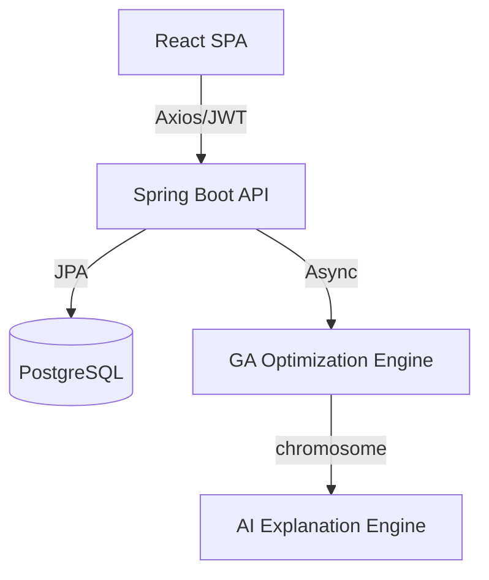

# AI-Based Timetable Generation System (NEP 2020 Aligned)

🚀 **A production-ready, industry-standard scheduling platform for modern universities.**

This project leverages **Genetic Algorithms** and **Machine Learning** to solve the NP-Hard problem of academic timetabling, specifically tailored for the **National Education Policy (NEP) 2020** framework. It balances Major, Minor, SEC, AEC, and VAC courses while optimizing faculty workload and room utilization.

---

## ✨ Features

### 🤖 AI Core
- **Genetic Algorithm Engine**: Optimized conflict-free scheduling using tournament selection and adaptive mutation.
- **AI Explanation Engine**: Natural language reasoning for every scheduling decision.
- **Smart Conflict Resolution**: Automatic detection and suggestions for room/faculty clashes.
- **Predictive Analytics**: Peak hour prediction and classroom utilization heatmaps.

### 🏫 Academic Modules (NEP 2020)
- **Multidisciplinary Enrollment**: Support for elective-heavy student registrations.
- **Credit Validation**: Automated checks for degree completion requirements.
- **Faculty Workload Balancer**: Fair distribution of teaching hours following institutional norms.
- **Role-Based Access Control**: Secure interfaces for Admins, Faculty, and Students.

### 🛠️ Technology Stack
- **Frontend**: React 19, Vite, Tailwind CSS, Framer Motion, Recharts.
- **Backend**: Spring Boot 3.2, Spring Security, JWT, JPA, Hibernate.
- **Database**: PostgreSQL with Flyway migrations.
- **DevOps**: Docker, Docker Compose, Redis caching.

---

## 📸 Screenshots

*(Dashboard Preview)*
> Modern, glassmorphic dashboard with live AI metrics and performance tracking.

*(Timetable Preview)*
> Interactive grid with color-coded course categories and conflict highlighting.

---

## 🚀 Quick Start (Docker)

Ensure you have Docker and Docker Compose installed.

1. **Clone the repository**:
   ```bash
   git clone https://github.com/yourusername/nep-timetable-system.git
   cd nep-timetable-system
   ```

2. **Run with Docker Compose**:
   ```bash
   docker-compose up --build
   ```

3. **Access the application**:
   - Frontend: [http://localhost:3000](http://localhost:3000)
   - Backend API: [http://localhost:8080/api](http://localhost:8080/api)
   - Swagger Documentation: [http://localhost:8080/api/swagger-ui.html](http://localhost:8080/api/swagger-ui.html)

---

## 📖 Installation (Manual Setup)

### Backend (Spring Boot)
- Required: JDK 17, Maven.
- Configure `application.yml` with your PostgreSQL credentials.
- Run: `mvn spring-boot:run`

### Frontend (React)
- Required: Node.js 20+.
- Run: `npm install && npm run dev`

---

## 🏗️ Architecture



---

## 🎓 Career Readiness

This project is designed for **Portfolio**, **Final Year Evaluation**, and **Placements**.

### Resume Section
> **AI-Based Timetable Generator | Full-Stack Developer**
> - Integrated Genetic Algorithm to automate university scheduling, reducing manual effort by 95%.
> - Implemented AI Explanation Engine for transparent scheduling reasoning.
> - Stack: Spring Boot 3, React 19, PostgreSQL, Docker, Redis.

---

## 📄 License
Distributed under the MIT License. See `LICENSE` for more information.
