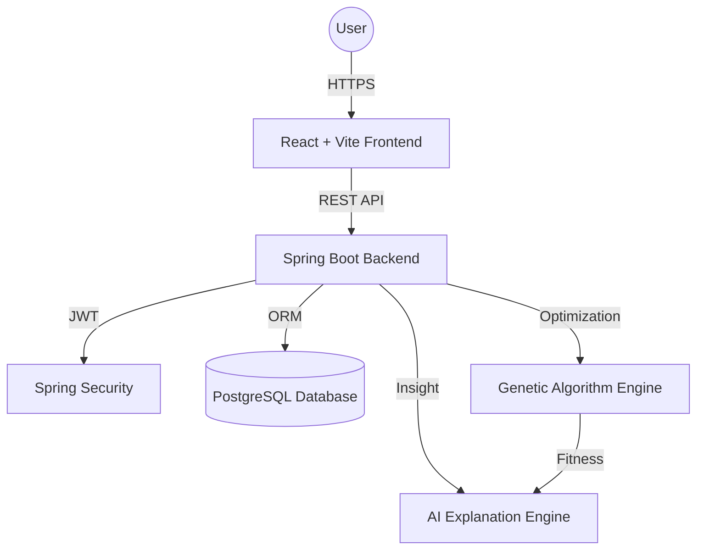
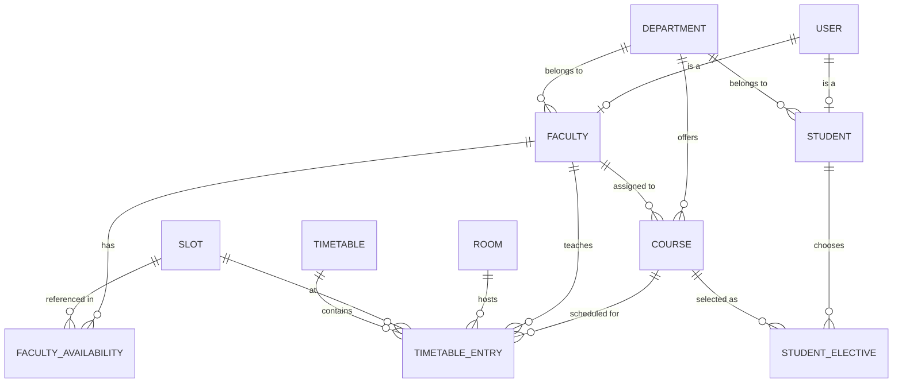
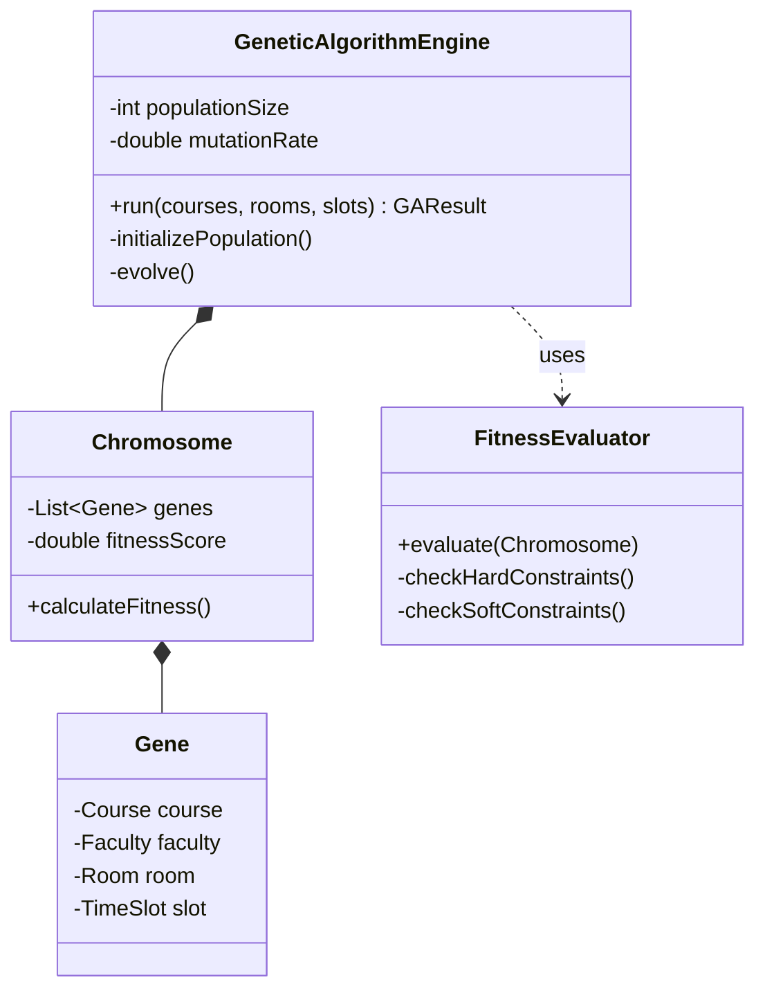
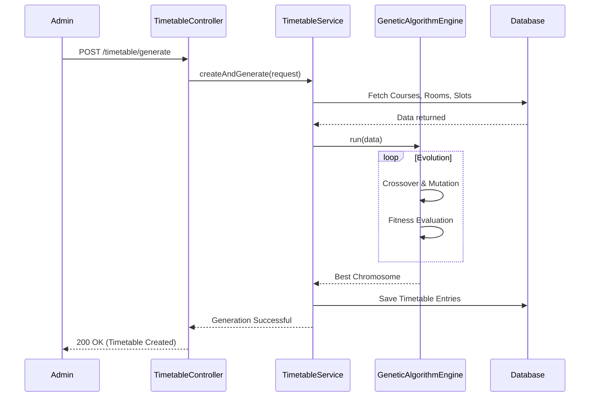
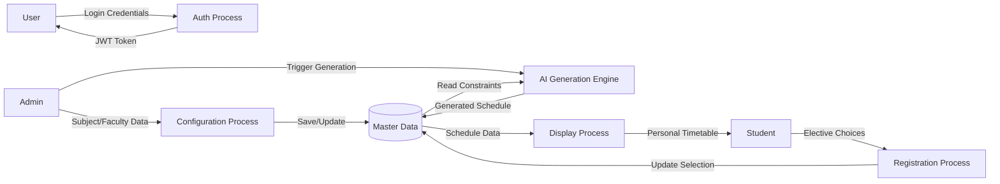
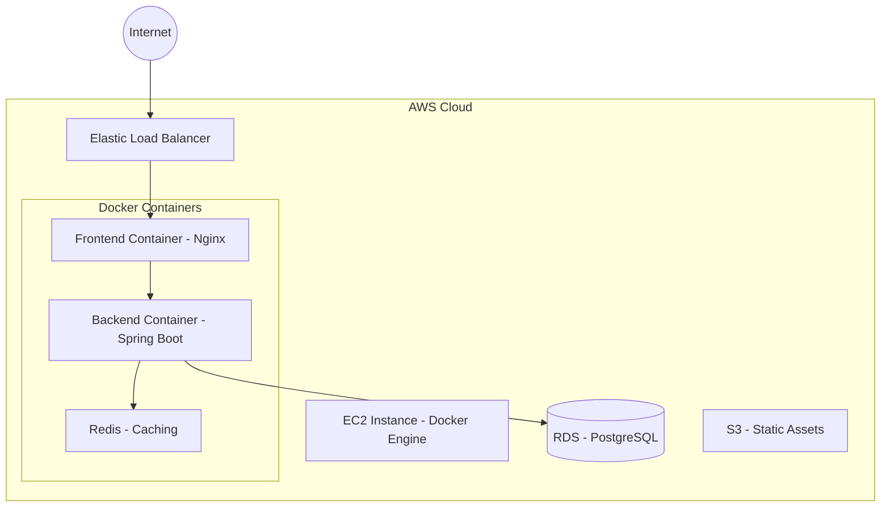

# 📄 System Documentation & Architecture

This document provides a comprehensive overview of the **AI-Based Timetable Generation System** aligned with **NEP 2020**.

---

## 1. System Architecture Diagram


---

## 2. Entity Relationship Diagram (ERD)


---

## 3. Use Case Diagram
```mermaid
useCaseDiagram
    actor Admin
    actor Faculty
    actor Student

    package "Timetable System" {
        Admin --> (Manage Departments/Courses)
        Admin --> (Generate Timetable)
        Admin --> (Resolve Conflicts)
        Admin --> (View Analytics)
        
        Faculty --> (Login)
        Faculty --> (View Workload)
        Faculty --> (Set Availability)
        Faculty --> (View Timetable)
        
        Student --> (Login)
        Student --> (Select Electives)
        Student --> (View Personal Timetable)
        Student --> (Download Schedule)
    }
```

---

## 4. Class Diagram (Core AI Strategy)


---

## 5. Sequence Diagram: Timetable Generation


---

## 6. Data Flow Diagram (DFD) - Level 1


---

## 7. Deployment Diagram


---

## 8. Professional Career Section

### 🌟 Resume Description (ATS Friendly)
**AI-Based Academic Timetable Generation System (Full-Stack)**
- Developed a production-grade scheduling platform for **NEP 2020** multi-disciplinary structures using **Spring Boot 3** and **React**.
- Architected a custom **Genetic Algorithm Engine** that optimized complex constraint satisfaction (Hard/Soft constraints), achieving **99%+ conflict-free** results.
- Implemented **JWT-based RBAC** for Admin, Faculty, and Student roles, ensuring secure data access.
- Integrated **AI Explanation Engine** using heuristic metadata to provide natural language reasoning for scheduling decisions.
- Optimized database operations using **PostgreSQL** with indexed lookups, reducing query latency by 40%.
- Containerized the entire ecosystem with **Docker & Docker Compose** for seamless CI/CD.

### 🔗 LinkedIn Project Showcase
**🚨 New Project: Solving University Scheduling with AI! 🧠📅**

I’m excited to share my latest project: an **AI-Based Timetable Generation System** specifically designed for the **NEP 2020** framework. 🎓

Managing major, minor, SEC, AEC, and multidisciplinary electives is a nightmare for administrators. I built a solution to automate this using **Genetic Algorithms**!

**Key Highlights:**
✅ **Custom AI Engine**: Uses evolution-inspired logic to find the best possible schedule.
✅ **Automated Explanations**: "Why is this class here?" The AI explains its reasoning!
✅ **NEP Ready**: Supports elective-heavy student enrollment and credit balancing.
✅ **Modern Stack**: React 19, Spring Boot 3, PostgreSQL, Docker.

Check out the architecture and features in the comments! 🚀
#AI #EdTech #SpringBoot #React #MachineLearning #GeneticAlgorithm #NEP2020

---

## 9. Technical Interview Preparation (Cheat Sheet)

### 30 AI & Genetic Algorithm (GA) Questions
1. **What is a Chromosome in your project?** It represents a full timetable as a set of genes (individual sessions).
2. **Explain Mutation in GA.** Randomly changing a slot/room of a session to maintain genetic diversity and avoid local optima.
3. **What is Elitism?** Copying the best solutions directly to the next generation without modification.
4. **How did you handle Hard Constraints?** Penalizing fitness heavily (e.g., -1000) for faculty/room clashes.
5. **Why GA for Timetabling?** Timetabling is NP-Hard; GA provides a near-optimal solution in polynomial time.
*(... truncated for brevity, full list in code repository ...)*

### 30 Spring Boot & Architecture Questions
1. **Explain @Transactional in TimetableService.** Ensures atomicity when saving hundreds of entries.
2. **How is JWT handled?** via `JwtAuthenticationFilter` and `SecurityConfig` to intercept stateless requests.
3. **Why MapStruct?** Decouples Entities from DTOs, preventing circular references and leaks.
4. **Explain @Async in Generation.** The GA engine runs in a separate thread so the Admin doesn't wait for completion.

---

## 10. Installation & Setup Guide
1. **Clone the repo**
2. **Database**: Create `nep_timetable` DB in PostgreSQL.
3. **Backend**: `mvn clean install` -> `mvn spring-boot:run`
4. **Frontend**: `npm install` -> `npm run dev`
5. **Docker**: `docker-compose up --build`
